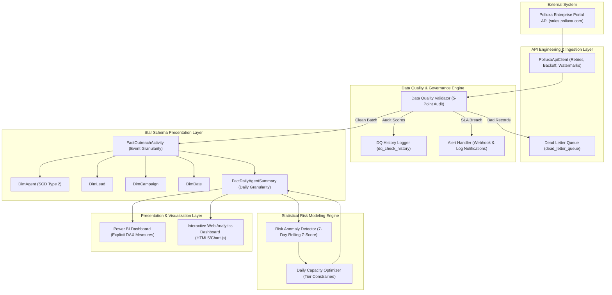

# End-to-End Architecture & Data Flow Specification

## System Architecture Diagram

---

## Key Ingestion & Modeling Stages

1. **Incremental Watermarked Extraction**:
   - `PolluxaApiClient` queries `/outreach/events?since={watermark}`.
   - Watermarks track the latest successful timestamp, ensuring zero redundant data fetches.
2. **5-Point Data Quality Audit**:
   - Every batch is checked across Completeness, Uniqueness, Validity, Timeliness, and Referential Integrity.
   - Weighted composite score computed: Pass threshold = 90%.
   - Failed payloads routed to `dead_letter_queue`.
3. **Idempotent Ingestion into Star Schema**:
   - `FactOutreachActivity` enforces natural key uniqueness (`event_id`). Re-runs skip existing keys.
   - `DimAgent` uses Slow Changing Dimension (SCD Type 2) tracking tier and status transitions.
4. **Statistical Risk Anomaly Detection**:
   - Evaluates 7-day rolling window Z-scores on acceptance rates and reply rates.
   - Identifies acceptance-rate collapse, reply decay, and ghosting spikes.
5. **Dynamic Capacity Optimization**:
   - Calculates recommended daily invite and message ceilings per agent, respecting Part 1 Account Age tier limits (<1M, 1M, 2-6M, 6-12M, 1+Yr).
